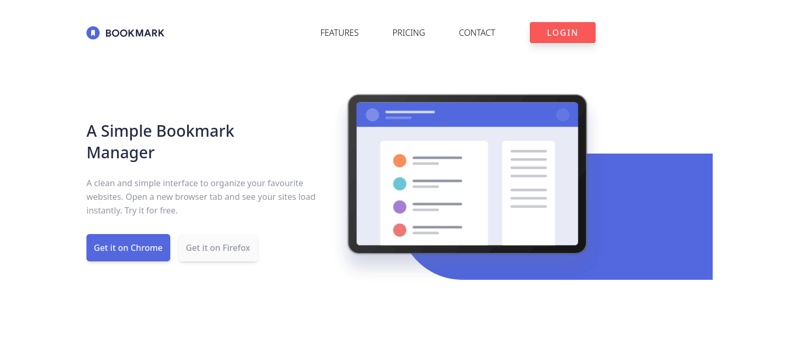
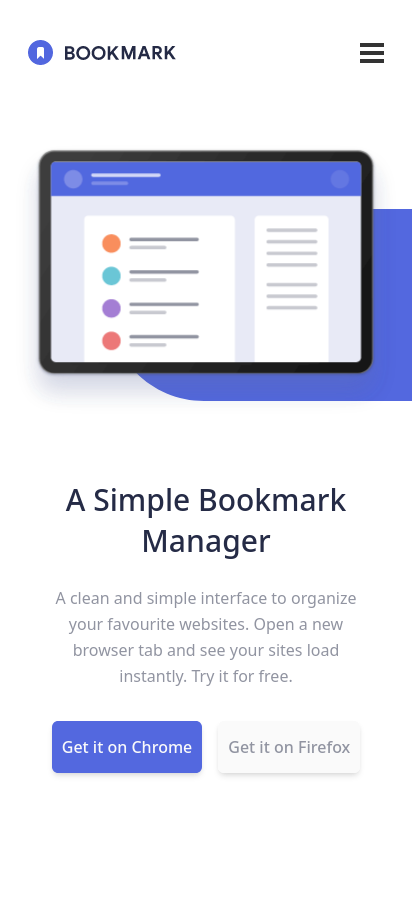

# Frontend Mentor - Bookmark landing page solution

This is a solution to the [Bookmark landing page challenge on Frontend Mentor](https://www.frontendmentor.io/challenges/bookmark-landing-page-5d0b588a9edda32581d29158).

## Table of contents

- [Overview](#overview)
  - [The challenge](#the-challenge)
  - [Screenshot](#screenshot)
  - [Links](#links)
- [My process](#my-process)
  - [Built with](#built-with)
  - [What I learned](#what-i-learned)
  - [Continued development](#continued-development)
  - [Useful resources](#useful-resources)
- [Author](#author)
- [Acknowledgments](#acknowledgments)

## Overview

### The challenge

Users should be able to:

- ✅ View the optimal layout for the site depending on their device's screen size
- ✅ See hover states for all interactive elements on the page
- Receive an error message when the newsletter form is submitted if:
  - ✅ The input field is empty
  - ✅ The email address is not formatted correctly

For this challenge:

- ✅ create the rounded blue background shape with code
- ❌ change the `fill` and `stroke` color of the SVGs at specific points (the challenge can be completed using the single `logo-bookmark.svg` file provided)

### Screenshot

|          Desktop           |          Mobile           |
| :------------------------: | :-----------------------: |
|  |  |

### Links

- [Solution](https://www.frontendmentor.io/solutions/mobilefirst-design-landing-page-using-tailwind-and-typescript-TUaPRdFHJM) submitted
- Preview [Live Site](https://the-bookmark-landing-page.netlify.app/)
- clone this project
  ```sh
  $ git clone https://github.com/theo-pombe/bookmark-landing-page.git
  ```

## My process

### Built with

- Semantic HTML5 markup
- [TypeScript](https://www.typescriptlang.org/) language
- Flexbox
- Mobile-first workflow
- [Tailwindcss](https://tailwindcss.com/) - CSS framework

### What I learned

#### Use group modifiers to handle states

- From this project I learn how I can style an element based on the state of its parent element using a tailwind group modifiers classes
- In the code below, The humberger menu bars are styled and made responsive by only controlling the parent element class.

```html
<div class="group is-open">
  <span
    class="group-[.is-open]:rotate-45 group-[.is-open]:translate-y-1 group-[.is-open]:bg-white"
  ></span>
  <span class="group-[.is-open]:hidden"></span>
  <span
    class="group-[.is-open]:-rotate-45 group-[.is-open]:-translate-y-1 group-[.is-open]:bg-white"
  ></span>
</div>
```

### Continued development

Some of the areas that I wish to continue focusing on in future projects are:-

- CSS Positioning
- Animations
- Responsive Design techniques

### Useful resources

- [Tailwindcss Official Documentation](https://tailwindcss.com/docs/installation) - The Documentation is amazing, helps me a lot with example code and explanations.
- [Build a Modern Landing Page With Tailwind CSS](https://www.youtube.com/watch?v=00gyCtIQp8E) - This is an amazing video tutorial which helped me finally understand tailwindcss framework to build a website. I'd recommend it to anyone still learning this concept.
- [How to create Tabs using HTML, CSS, and JAVASCRIPT](https://www.youtube.com/watch?v=nlOmgBHnLqQ) - This is an amazing video which helped me finally understand how to create responsive navigation tabs to show different content. I'd recommend it to anyone still learning this concept.
- [How to Do an Email Validation in JavaScript?](https://www.simplilearn.com/tutorials/javascript-tutorial/email-validation-in-javascript) - This is an amazing article which helped me finally understand how to validate email using regular expressions in javascript. I'd recommend it to anyone still learning this concept.

## Author

- Website - [Mathew Maro Joseph](https://github.com/theo-pombe/theo)
- Frontend Mentor - [@theo-pombe](https://www.frontendmentor.io/profile/theo-pombe)
- Twitter - [@theo_pombe](https://www.twitter.com/theo_pombe)

## Acknowledgments

- Special thanks to my friend [Adam](https://www.twitter.com/adamShabanih) for encouragement and support
- Much credit to [Kamlesh](https://www.frontendmentor.io/profile/Kamlesh0007) and [John Komarnicki](https://twitter.com/john_komarnicki)
